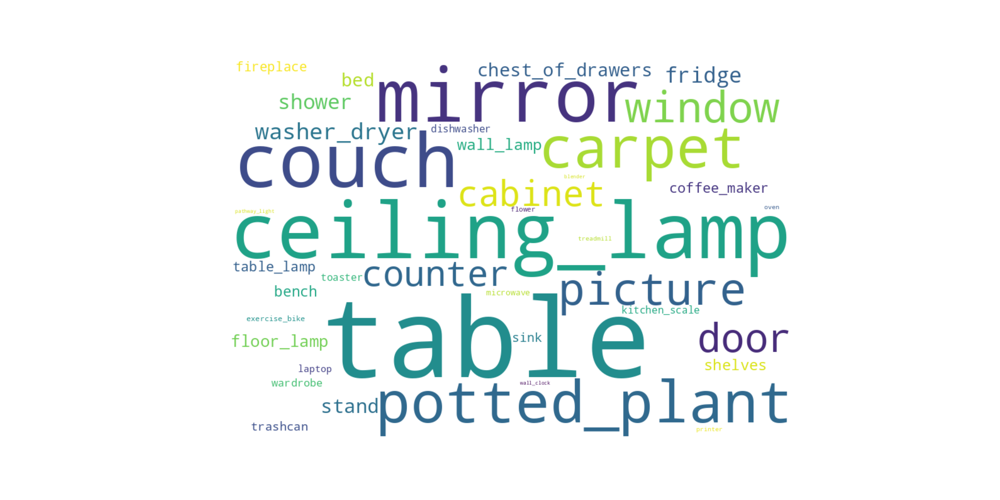

# CoNav_Supplementary
Supplementary material for the paper "CoNav: A Benchmark for Human-Centered Collaborative Navigation"

## 1. Statistics of CoNav Dataset
### 1.1 Destination Object
The bar charts of destination object counts in train split

The bar charts of destination object counts in test split

### 1.2 Graspable Object
The bar charts of graspable object counts in train split

The bar charts of graspable object counts in test split

### 1.3 Action
The bar charts of action counts in train split

The bar charts of action counts in test split

### 1.4 WordCloud
<!--  -->
<figure class="half">
    
    
</figure>
### 1.5 Distribution
