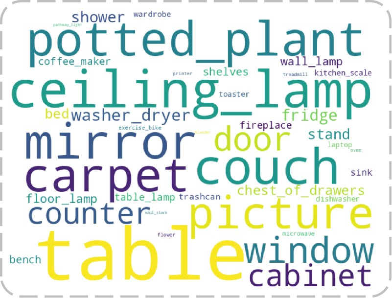
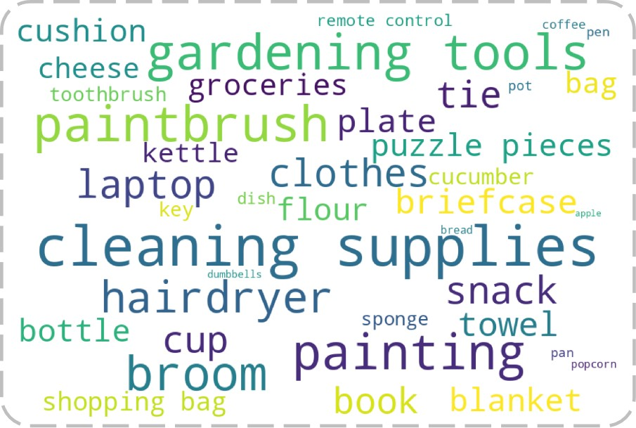
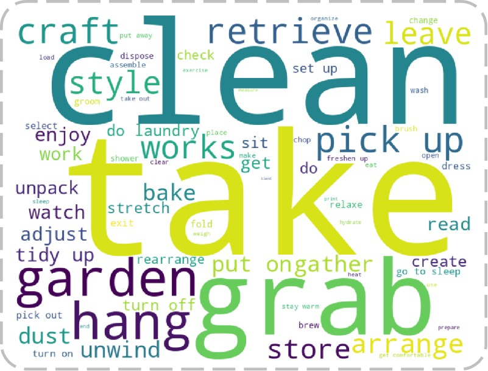

# CoNav_Supplementary
Supplementary material for the paper "CoNav: A Benchmark for Human-Centered Collaborative Navigation"

## 1. Statistics of CoNav Dataset
### 1.1 Destination Object
The bar charts of destination object counts in train split

The bar charts of destination object counts in test split

The word cloud of destination object in the dataset.

### 1.2 Graspable Object
The bar charts of grasp object counts in train split

The bar charts of grasp object counts in test split

The word cloud of grasp object in the dataset.

### 1.3 Action
The bar charts of action counts in train split

The bar charts of action counts in test split

The word cloud of action in the dataset.

<!-- ### 1.4 WordCloud
 -->
<!-- 

    
    
    

 -->

### 1.4 Distribution

## 2. Humanoid Animation Results

  

    
    
A person cleans brushes at the sink.

  

  

    
    
A person exercises on the treadmill.

  

  

    
    
A person picks up a toothbrush from the sink.

  

  

    
    
A person takes a water bottle from the table.

  

  

    
    
A person takes books from the shelves.

  

  

    
    
A person dresses in front of the mirror.

  

  

    
    
A person gardens near the potted plant.

  

  

    
    
A person showers in the shower.

  

  

    
    
A person picks out clothes from the wardrobe.

  

