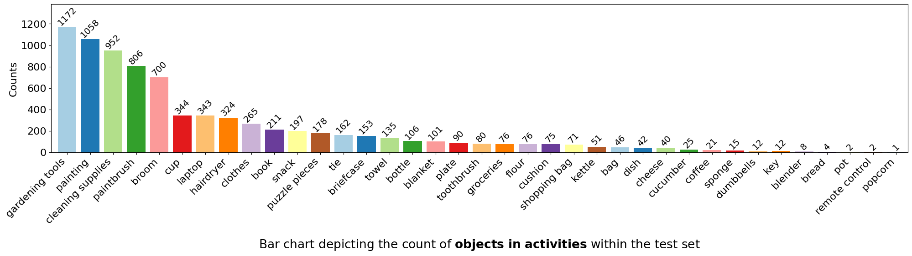
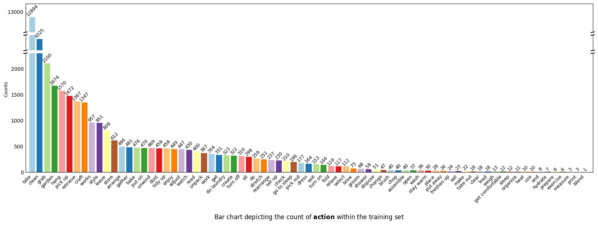

# CoNav_Supplementary
Supplementary material for the paper "CoNav: A Benchmark for Human-Centered Collaborative Navigation"

## 1. Statistics of CoNav Dataset
### 1.1 Destination Objects

There are *41 destination object* in our dataset, which is parsed from HSSD dataset. This set of destination objects covers a diverse range of items within various rooms.

#### (a) train split

Bar chart depicting the count of *destination objects* in the training set

#### (b) test split

Bar chart depicting the count of *destination objects* in the test set

### 1.2 Objects in Activities

There are *40 objects in activities* within our dataset, which is parsed from LLM-generated data.

#### (a) train split

Bar chart depicting the count of *objects in activities* within the training set

#### (b) test split

Bar chart depicting the count of *objects in activities* within the test set

### 1.3 Actions

*76 actions* in our dataset are entirely generated by LLM, which covers various aspects of human life and demonstrates the diversity of action types in our dataset.

#### (a) train split

Bar chart depicting the count of *action* within the training set

#### (b) test split

Bar chart depicting the count of *action* within the test set

### 1.4 Intentions

There are *108 intentions* in our dataset, which is the second-stage activity and is intention-related with first-stage activity.

#### (a) train split

Bar chart depicting the count of *intention* within the training set

#### (b) test split

Bar chart depicting the count of *intention* within the test set

### 1.5 Distribution of navigation trajectory length and episode length

Distribution of navigation trajectory length and episode length in the CoNav dataset. ("Trajectory Length" refers to the geodesic distance of the entire navigation trajectory from the starting position to the target object position. "Episode Length" indicates the number of steps in an episode. The dashed lines represent the respective mean values)
- Left: Distribution of agent navigation trajectory length. 
- Middle: Distribution of humanoid navigation trajectory length. 
- Right: Distribution of episode length. 

This figure showcases the diversity in trajectory lengths and episode lengths. These trajectories include activities with both long and short horizons, providing a more comprehensive reflection of the agent's ability to recognize human intentions and assist in task completion.

