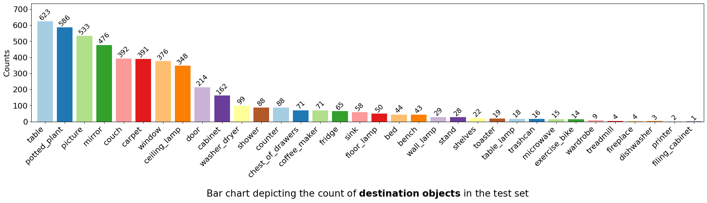

# CoNav_Supplementary
Supplementary material for the paper "CoNav: A Benchmark for Human-Centered Collaborative Navigation"

## 1. Statistics of CoNav Dataset
### 1.1 Destination Object
The bar charts of destination object counts in train split

The bar charts of destination object counts in test split

The word cloud of destination object in the dataset.

### 1.2 Graspable Object
The bar charts of grasp object counts in train split

The bar charts of grasp object counts in test split

The word cloud of grasp object in the dataset.

### 1.3 Action
The bar charts of action counts in train split

The bar charts of action counts in test split

The word cloud of action in the dataset.

<!-- ### 1.4 WordCloud
 -->
<!-- 

    
    
    

 -->

### 1.4 Distribution

