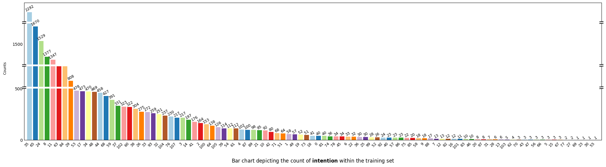
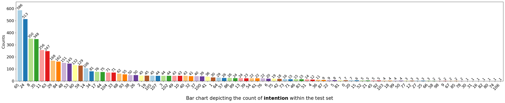
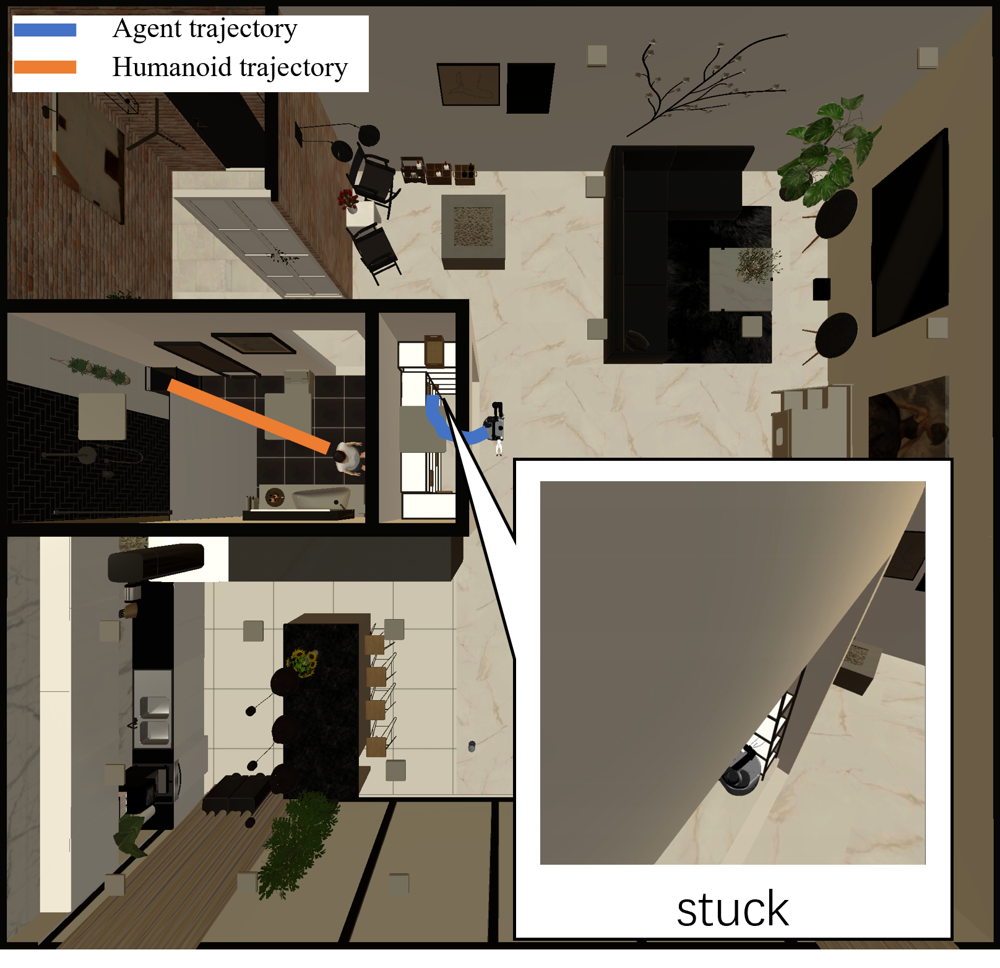

# CoNav Supplementary for Rebuttal
This is the supplementary material for paper "CoNav: A Benchmark for Human-Centered Collaborative Navigation"

We organize our supplementary material as follows:
- In Section [A](#jump-A), we provide the statistics of destination objects.
- In Section [B](#jump-B), we provide the statistics of activity objects.
- In Section [C](#jump-C), we provide the statistics of human actions.
- In Section [D](#jump-D), we provide the statistics of human activities.
- In Section [E](#jump-E), we demonstrate the distribution of navigation trajectory lengths and episode steps.
- In Section [F](#jump-F), we provide more qualitative results of generated humanoid animations.
- In Section [G](#jump-F), we provide more qualitative results of agent navigation.

<!-- ## 1. Statistics of CoNav Dataset -->
### A. Statistics of Destination Objects

The destination objects are utilized to identify the human destination, for example, *"the human takes a book from the **bookrest**"*. In the training split, there are *40 types of destination objects* while the test split features *34 types*, 33 of which are overlapped. 
<!-- In each scene, we select multiple navigable destination objects to construct destination object set $\mathbf{O}_D$. Then we instruct the LLM to pick a destination object and generate an activity that make sense. -->

#### (a) Training split

<!-- Bar chart depicting the count of *destination objects* in the training set -->

#### (b) Test split

<!-- Bar chart depicting the count of *destination objects* in the test set -->

### B. Statistics of Activity Objects

The activity objects are interaction targets in the generated human activities, for example, *"the human takes a **book** from the bookrest"*. In the training split, there are *39 types of destination objects* while the test split features *37 types*, 36 of which are overlapped.
<!-- There are *40 objects in activities* within our dataset, which is parsed from LLM-generated data. -->

#### (a) Training split

<!-- Bar chart depicting the count of *objects in activities* within the training set -->

#### (b) Test split

<!-- Bar chart depicting the count of *objects in activities* within the test set -->

### C. Actions

There are 76 types of human actions in all LLM-synthesized activities, for example, *"the human **takes** a book from the bookrest"*. In the training split, there are *75 types* while the test split features *70 types*, 69 of which are overlapped.
<!-- *76 actions* in our dataset are entirely generated by LLM, which covers various aspects of human life and demonstrates the diversity of action types in our dataset. -->

#### (a) Training split

<!-- Bar chart depicting the count of *action* within the training set -->

#### (b) Test split

<!-- Bar chart depicting the count of *action* within the test set -->

### D. Human Activities

We summarize the statistic of 101 unique LLM-synthesized human activities in this section, for example, *"**the human takes a book from the bookres**t"*. In the training split, there are *97 types* while the test split features *88 types*, 84 of which are overlapped.
<!-- There are *108 intentions* in our dataset, which is the second-stage activity and is intention-related with first-stage activity. -->

#### (a) Training split

<!-- Bar chart depicting the count of *intention* within the training set -->

#### (b) Test split

<!-- Bar chart depicting the count of *intention* within the test set -->

### E. Distribution of navigation trajectory lengths and episode steps

In this section, we demonstrate the distribution of navigation trajectory lengths and episode steps in the CoNav dataset. ("Trajectory Lengths" refers to the geodesic distance of the entire navigation trajectory from the starting position to the target object position. "Episode Steps" indicates the number of steps in an episode. The dashed lines represent the respective mean values)
- Left: Distribution of agent navigation trajectory lengths. 
- Middle: Distribution of humanoid navigation trajectory lengths. 
- Right: Distribution of episode steps. 

This figure showcases the diversity in trajectory lengths and episode steps. These trajectories include activities with both long and short horizons, providing a more comprehensive reflection of the agent's ability to recognize human intentions and assist in task completion.

## F. Qualitive Results of Humanoid Animation

<!-- 

  

    
    
A person cleans brushes at the sink.

  

  

    
    
A person exercises on the treadmill.

  

  

    
    
A person picks up a toothbrush from the sink.

  

  

    
    
A person takes a water bottle from the table.

  

  

    
    
A person takes books from the shelves.

  

  

    
    
A person dresses in front of the mirror.

  

  

    
    
A person gardens near the potted plant.

  

  

    
    
A person showers in the shower.

  

  

    
    
A person picks out clothes from the wardrobe.

  

 -->

<table style="width: 100%; text-align: center;">
  <tr>
    <td style="width: 30%; padding: 0 0%;">
      
      
A person cleans brushes at the sink.

    </td>
    <td style="width: 30%; padding: 0 0%;">
      
      
A person exercises on the treadmill.

    </td>
    <td style="width: 30%; padding: 0 0%;">
      
      
A person picks up toothbrush from the sink.

    </td>
  </tr>
</table>

<table style="width: 100%; text-align: center;">
  <tr>
    <td style="width: 30%; padding: 0 0%;">
      
      
A person takes a bottle from the table.

    </td>
    <td style="width: 30%; padding: 0 0%;">
      
      
A person takes books from the shelves.

    </td>
    <td style="width: 30%; padding: 0 0%;">
      
      
A person dresses in front of the mirror.

    </td>
  </tr>
</table>

<table style="width: 100%; text-align: center;">
  <tr>
    <td style="width: 30%; padding: 0 0%;">
      
      
A person gardens near the potted plant.

    </td>
    <td style="width: 30%; padding: 0 0%;">
      
      
A person leisurely showers in the shower.

    </td>
    <td style="width: 30%; padding: 0 0%;">
      
      
A person picks out clothes from the wardrobe.

    </td>
  </tr>
</table>

### Complete Action Display

  
   
  <strong>A person takes a water bottle from the table.  ➔  A person hydrates on the treadmill.</strong>
   

  
   
  <strong>A person grabs gardening tools from the table.  ➔  A person gardens near the potted plant.</strong>
   

  
   
  <strong>A person takes a broom.  ➔  A person cleans the carpet.</strong>
   

## G. Visualization Results for Navigation

### G-1. Failure Cases of Pioneer Agent

#### (a) conflicts with human actions, leading to collisions

#### (b) heuristic algorithm occasionally plans waypoints that are not navigable, making the agent stuck

### G-2. Failure Cases of Vanilla Agent

